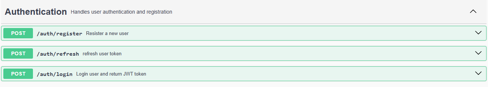
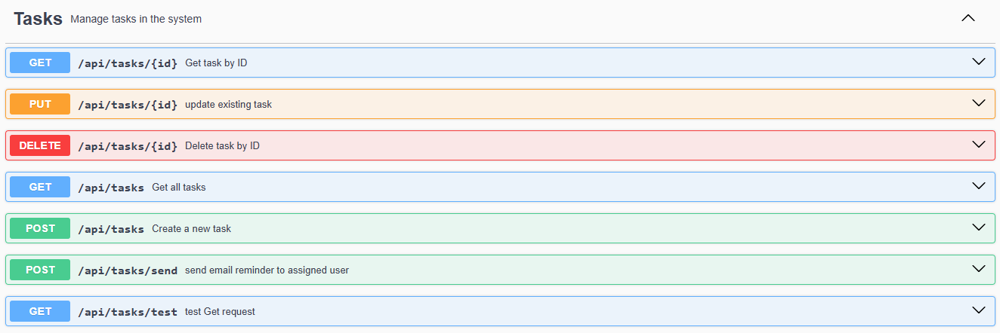

# Task-Management-System
## 1. Introduction 
The Task Management System is a Spring Boot application that provides authentication, task management, assignment, status updates, due date reminders, and logging functionalities.
It uses JWT for security, and notifications are sent via email.

---

## 2. Technologies Used
<ul>
  <li>Spring Boot</li>
  <li>Spring Security & JWT</li>
  <li>Spring Data JPA (Hibernate & PostgreSQL)</li>
  <li>Spring AOP (Logging)</li>
  <li>Spring Scheduler (Task Reminders)</li>
  <li>Java Mail API (Email Notifications)</li>
  <li>Lombok</li>
</ul>

---

## 3.  Authentication & Authorization
### 3.1. User Entity
```java
@Entity
@Table(name = "users")
public class User {
    @Id
    @GeneratedValue(strategy = GenerationType.IDENTITY)
    private Long id;
    private String username;
    private String password;
    private String email;
    private String role;
}
```
### 3.2. Password Encryption
```java
@Bean
public PasswordEncoder passwordEncoder() {
    return new BCryptPasswordEncoder();
}
```
### 3.3. JWT Utility
 Handles JWT generation and validation.

### 3.4. Security Configuration
Defines authentication and authorization policies.

---

## 4. Task Management
### 4.1. Task Entity
```java
@Entity
@Table(name = "tasks")
public class Task {
    @Id
    @GeneratedValue(strategy = GenerationType.IDENTITY)
    private Long id;
    private String title;
    private String description;
    private LocalDate dueDate;
    @Enumerated(EnumType.STRING)
    protected Priority  priority;
    @Enumerated(EnumType.STRING)
    private Status status;
    private User assignedUser;
    ...
}
```
### 4.2. Task CRUD Operations
 Implemented in TaskService and exposed via TaskController.
 
---

## 5. Due Date Reminders
### 5.1. Scheduled Reminder Service
```java
@Scheduled(cron = "0 0 9 * * ?") // Runs daily at 9 AM
public void sendReminders() {
    taskService.checkDueTasks();
}
```

---

## 6. Notifications System
### 6.1. Email Notifications
```java
public void sendEmail(String to, String subject, String body) {
    SimpleMailMessage message = new SimpleMailMessage();
    message.setTo(to);
    message.setSubject(subject);
    message.setText(body);
    mailSender.send(message);
}
```

---

## 7. Logging with AOP
### 7.1. Logging Aspect
```java
@Aspect
@Component
public class LoggingAspect {
    private static final Logger logger = LoggerFactory.getLogger(LoggingAspect.class);

    @Before("execution(* com.task.TaskManagement.service..(..))")
    public void logBeforeMethod(JoinPoint joinPoint) {
        logger.info("Executing: {}", joinPoint.getSignature().toShortString());
    }
}
```

---

## 8. API Endpoints
**user Authentication**
| Method      | Endpoint | Description     |
| :---        |    :----:   |          ---: |
| POST  | auth/register    | Register a new user  |
| POST  | auth/login       | Login user and return a token      |
| POST  | auth/refresh     | refresh user token   |



**Tasks Management**
| Method  | Endpoint        | Description        |
| :---    |    :----:       |          ---:      |
| GET     | api/tasts       | Retrive all Tasks  |
| GET     | api/tasts/{id}  | Retrive Task by Id |
| POST    | api/tasts       | Create new Task    |
| POST    | api/tasts/send  | send email reminder to assigned user   |
| UPDATE  | api/tasts/{id}  | Update a task      |
| DELETE  | api/tasts/{id}  | Delete a task      |



---

##  Conclusion
This document covers the full implementation of the Task Management System. Each step ensures a robust and scalable task management solution with authentication, task tracking, reminders, and logging.


 


